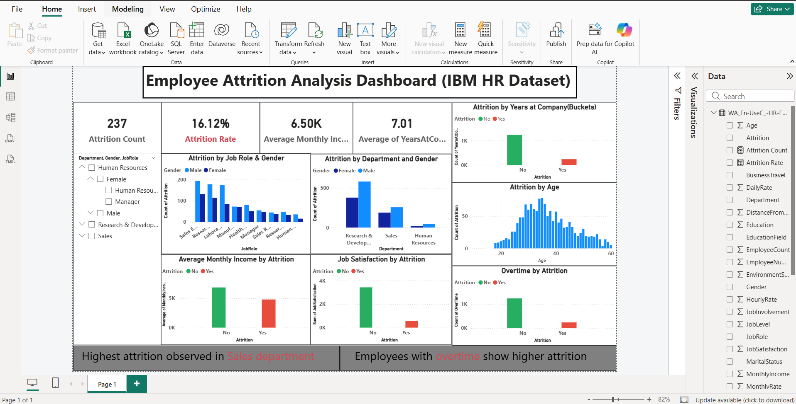

# 📊 Employee Attrition Analysis Dashboard (Power BI)

## 📌 Project Overview

This project presents an interactive Power BI dashboard designed to analyze employee attrition and identify key factors contributing to employee turnover within an organization.

The dashboard enables HR teams and decision-makers to gain actionable insights and improve employee retention strategies.

---

## 🎯 Business Objective

Employee attrition is a critical challenge for organizations. This project aims to:

* Identify key drivers of employee attrition
* Analyze patterns across departments, roles, and demographics
* Support data-driven HR decision-making

---

## 📊 Key Insights

* 🔴 Highest attrition observed in the **Sales department**
* ⏱ Employees working **overtime** are more likely to leave
* 😊 Lower **job satisfaction** leads to increased attrition
* 💰 Employees with lower income show higher attrition trends
* 📉 Early-career employees (low years at company) are more likely to leave

---

## 📈 Dashboard Features

* KPI Cards:

  * Attrition Rate (%)
  * Attrition Count
  * Average Monthly Income
  * Average Years at Company

* Analytical Visuals:

  * Attrition by Department & Job Role
  * Attrition by Age Group
  * Salary Impact on Attrition
  * Job Satisfaction Analysis
  * Overtime Impact on Attrition

* Interactive Filters (Slicers):

  * Department
  * Job Role
  * Gender

---

## 🛠 Tools & Technologies Used

* **Power BI** – Dashboard development
* **DAX (Data Analysis Expressions)** – KPI calculations
* **Data Visualization** – Insight generation

---

## 📂 Project Structure

project-files/

├── employee-attrition-dataset.csv
├── employee-attrition-dashboard.pbix
└── dashboard.png

---

## 📷 Dashboard Preview

---

## 📁 Dataset Information

* Dataset: IBM HR Employee Attrition Dataset
* Contains employee-level data including:

  * Age
  * Salary
  * Job Role
  * Department
  * Job Satisfaction
  * Work-Life Balance
  * Attrition (Yes/No)

---

## 🚀 How to Use This Project

1. Download the `.pbix` file from the repository
2. Open it using Power BI Desktop
3. Interact with filters and visuals to explore insights

---

## 🧠 Key Learnings

* Built end-to-end HR analytics dashboard
* Applied DAX for KPI calculations and measures
* Improved data storytelling using effective visual design
* Translated raw data into actionable business insights

---

## 🎯 Conclusion

This dashboard helps organizations understand the root causes of employee attrition and supports strategic decision-making to improve employee retention and satisfaction.

---

## 🔗 Future Improvements

* Add predictive modeling for attrition
* Integrate real-time HR data
* Enhance dashboard interactivity

---

⭐ If you found this project useful, consider giving it a star!
